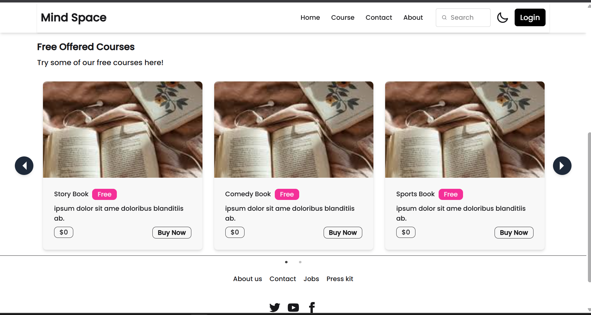
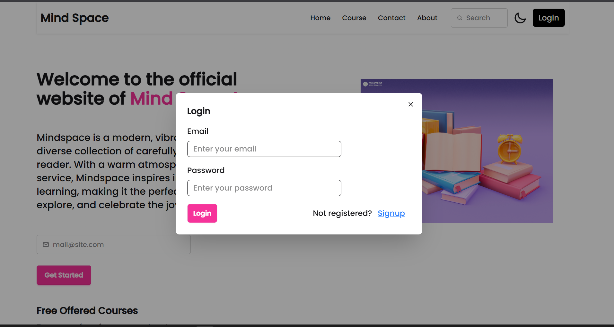
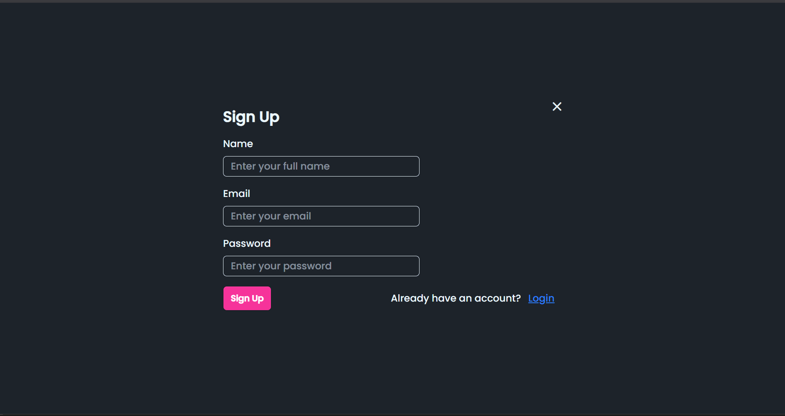
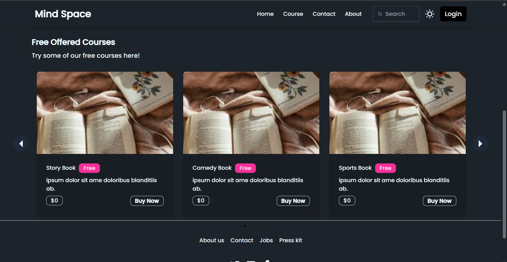
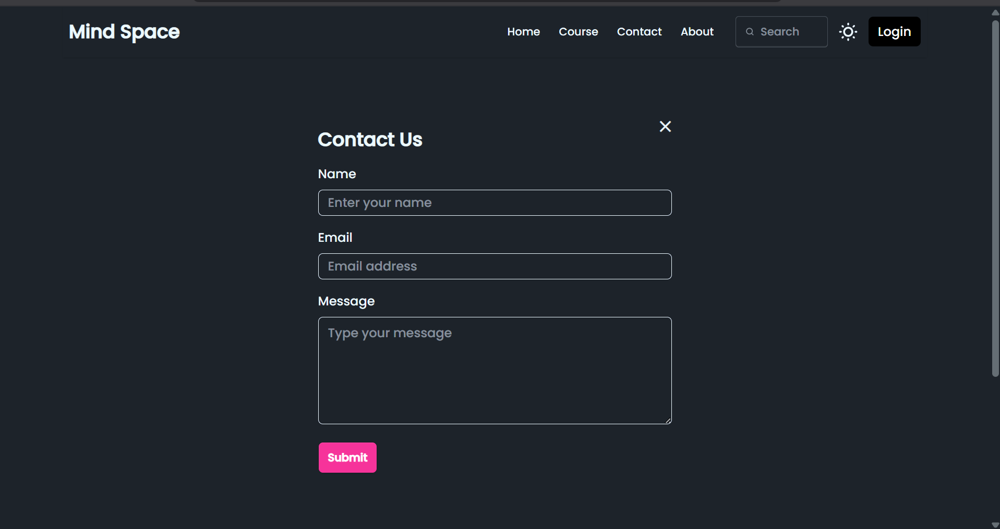

# 📚 My Book Store

A full-stack bookstore web application built with the **MERN stack** (MongoDB, Express.js, React.js, Node.js) and **Vite** for a modern, high-performance development experience. The app offers a simple and secure way to explore free books, manage user accounts, and protect premium book listings for registered users.

---

## 🚀 Features

✅ Display a collection of free books on the home page <br>
✅ User authentication (signup, login, logout) <br>
✅ Protected routes — only logged-in users can view the *Courses* section with the full book list <br>
✅ Modular codebase with clear frontend/backend separation <br>
✅ Search bar UI (functionality in progress) <br>
✅ Tailwind CSS and DaisyUI for responsive, modern styling <br>
✅ Light/Dark mode toggle for theme switching

---

## 🗓 Planned Features

* Fully working search functionality *(UI present, not implemented yet)*
* Form validation for user inputs *(planned)*
* Payment integration for premium books *(planned)*
* User reviews and ratings *(planned)*
* Better error handling and notifications *(planned)*

---

## 🛠 Tech Stack

**Frontend**

* React.js (with Vite)
* Tailwind CSS
* DaisyUI
* Axios

**Backend**

* Node.js
* Express.js
* MongoDB (Mongoose)
* CORS (Cross-Origin Resource Sharing)
* bcrypt (for password hashing)
* dotenv (for environment variables)
* JSON Web Token (JWT) for authentication
* axios (if used for backend API calls)
* nodemon (for development)

---

## 📁 Project Structure

```
/bookstore
  ├── .git/                            # Git tracking
  ├── frontend/                        # React frontend with Vite
  │   ├── .gitignore
  │   ├── eslint.config.js
  │   ├── index.html
  │   ├── package.json
  │   ├── package-lock.json
  │   ├── tailwind.config.js
  │   ├── vite.config.js
  │   ├── dist/                        # Production build output
  │   ├── node_modules/                # Frontend dependencies
  │   ├── public/
  │   │    ├── _redirects
  │   │    ├── bookpic.jpg
  │   │    └── vite-some.html
  │   └── src/
  │       ├── App.jsx
  │       ├── index.css
  │       ├── main.jsx
  │       ├── assets/
  │       │    └── images/
  │       ├── components/
  │       │    ├── Banner.jsx
  │       │    ├── Cards.jsx
  │       │    ├── Contact.jsx
  │       │    ├── Course.jsx
  │       │    ├── Footer.jsx
  │       │    ├── Freebook.jsx
  │       │    ├── Login.jsx
  │       │    ├── Logout.jsx
  │       │    ├── Navbar.jsx
  │       │    └── Signup.jsx
  │       ├── contacts/
  │       │    └── Contacts.jsx
  │       ├── context/
  │       │    └── AuthProvider.jsx
  │       ├── courses/
  │       │    └── Courses.jsx
  │       └── home/
  │            └── Home.jsx
  └── backend/                         # Node/Express backend
      ├── .env
      ├── index.js
      ├── package.json
      ├── package-lock.json
      ├── node_modules/                # Backend dependencies
      ├── controller/
      │     ├── book.controller.js
      │     └── user.controller.js
      ├── model/
      │     ├── book.model.js
      │     └── user.model.js
      └── route/
            ├── book.route.js
            └── user.route.js
```

---

## 🔗 Installation & Setup

1️⃣ **Clone the repository**

```bash
[git clone https://github.com/your-username/your-repo.git](https://github.com/Rojahasini/BookStoreApp.git)
```

---

2️⃣ **Set up the frontend**

```bash
cd bookstore/frontend
npm install
```

---

3️⃣ **Set up the backend**

```bash
cd ../backend
npm init -y
```

Install backend dependencies:

```bash
npm install express mongoose cors dotenv bcrypt jsonwebtoken axios
```

Install development dependencies:

```bash
npm install --save-dev nodemon
```

---

4️⃣ **Create a `.env` file** in the `backend` folder with the following contents:

```env
MONGO_URI=your_mongo_connection_string
JWT_SECRET=your_jwt_secret
```

---

5️⃣ **Start the backend server**

```bash
npm start
```

---

6️⃣ **Start the frontend**

```bash
cd ../frontend
npm run dev
```

---

## 🖥️ Screenshots


```markdown
[](screenshots/homepage.png)
[](screenshots/courses.png)
[](screenshots/login.png)
[](screenshots/signup.png)
[](screenshots/navbar_loggedout.png)
[](screenshots/navbar_loggedin.png)
[](screenshots/responsive.png)
[](screenshots/darkmode.png)
[](screenshots/contact.png)

```


---

## 🤝 Contributing

Contributions, issues, and feature requests are welcome! Feel free to open an issue or submit a pull request.

---

## 📄 License

This project is licensed under the **MIT License** — meaning it is open-source and free to use with proper attribution.

---
